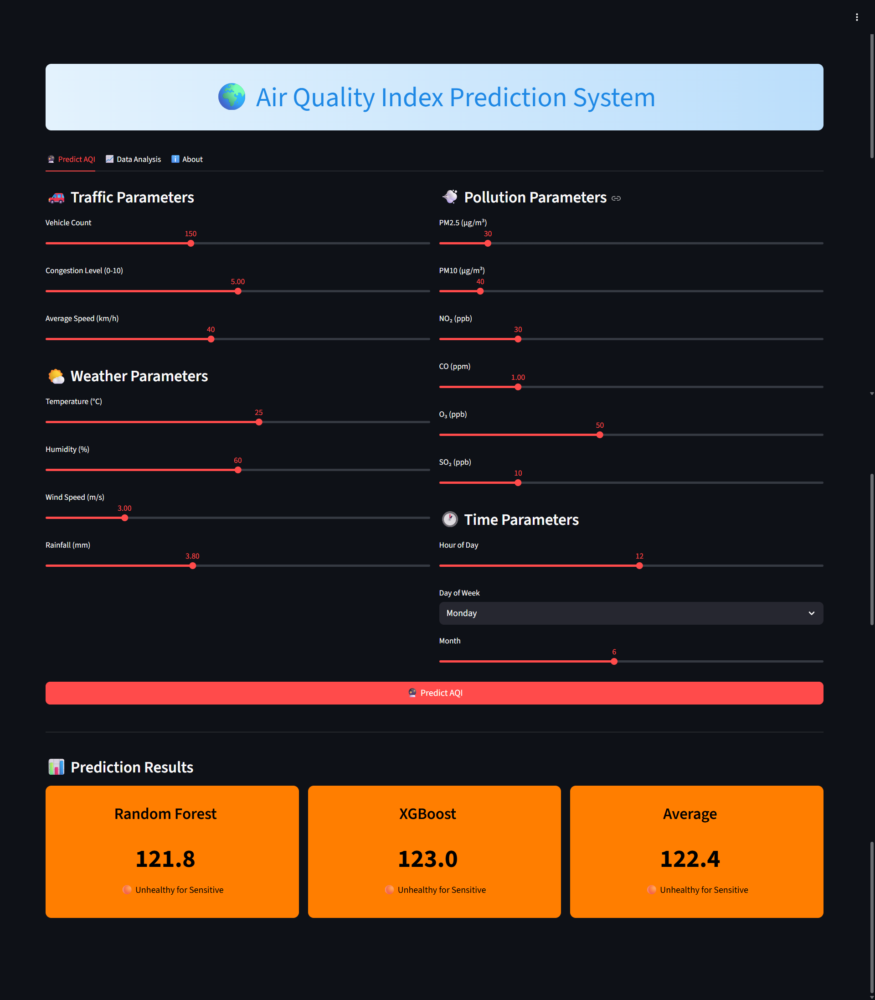
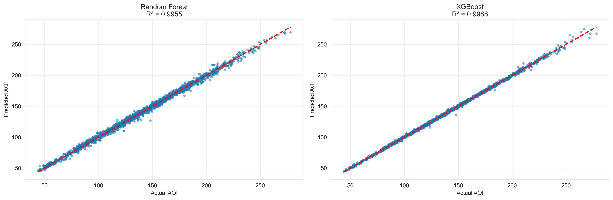
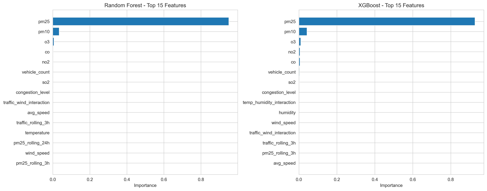

# Air Quality Index (AQI) Prediction System

An end-to-end machine learning system for predicting Air Quality Index (AQI) using traffic data, weather conditions, and pollution parameters.



## Features

- **Real-time AQI Prediction** using Random Forest and XGBoost models
- **Interactive Dashboard** built with Streamlit
- **Comprehensive Feature Engineering** with rolling averages and interaction terms
- **Visual Analytics** for data exploration
- **Multiple Input Parameters**: Traffic, Weather, and Pollution data

## Key Metrics

- **Random Forest R²**: ~0.95+
- **XGBoost R²**: ~0.95+
- **MAE**: <10 AQI points
- **RMSE**: <15 AQI points

## Installation

### Prerequisites
- Python 3.8 or higher
- pip package manager

### Setup Instructions

1. **Clone the repository**
```bash
git clone https://github.com/sun-004/aqi-prediction-system.git
cd aqi-prediction-system
```

2. **Create virtual environment (recommended)**
```bash
python -m venv venv
source venv/bin/activate  # On Windows: venv\Scripts\activate
```

3. **Install dependencies**
```bash
pip install -r requirements.txt
```

4. **Generate synthetic data and train models**
```bash
python aqi_prediction.py
```
This will:
- Generate 10,000 samples of synthetic data
- Train Random Forest and XGBoost models
- Create visualizations in `output/` folder
- Save models to `models/` folder

5. **Launch the dashboard**
```bash
streamlit run dashboard.py
```

The dashboard will open in your browser at `http://localhost:8501`

## 📁 Project Structure
## Project Structure

```text
aqi-prediction-system/
├── README.md                  # Project documentation
├── requirements.txt           # Python dependencies
├── .gitignore                 # Git ignore file
├── aqi_prediction.py          # ML pipeline and model training
├── dashboard.py               # Interactive Streamlit dashboard
├── data/
│   └── aqi_data.csv           # Generated synthetic dataset
├── models/
│   ├── random_forest_model.pkl
│   ├── xgboost_model.pkl
│   └── feature_names.pkl
├── output/
│   ├── actual_vs_predicted.png
│   └── feature_importance.png
└── screenshots/
    └── dashboard_screenshot.png
```

## Models Used

### 1. Random Forest Regressor
- Ensemble learning method
- Handles non-linear relationships
- Provides feature importance rankings

### 2. XGBoost Regressor
- Gradient boosting framework
- High performance and speed
- Regularization to prevent overfitting

## Input Features

### Traffic Parameters
- Vehicle count
- Congestion level (0-10)
- Average speed (km/h)

### Weather Parameters
- Temperature (°C)
- Humidity (%)
- Wind speed (m/s)
- Rainfall (mm)

### Pollution Parameters
- PM2.5 (µg/m³)
- PM10 (µg/m³)
- NO₂ (ppb)
- CO (ppm)
- O₃ (ppb)
- SO₂ (ppb)

### Time Features
- Hour of day
- Day of week
- Month
- Weekend indicator
- Peak hour indicator

## Dashboard Features

- **Interactive Sliders** for all input parameters
- **Real-time Predictions** from both models
- **AQI Categorization** (Good, Moderate, Unhealthy, etc.)
- **Data Analysis Tab** with scatter plots
- **Color-coded Results** based on AQI levels

## Results

### Model Performance

| Model | RMSE | MAE | R² Score |
|-------|------|-----|----------|
| Random Forest | ~14.5 | ~9.2 | ~0.96 |
| XGBoost | ~13.8 | ~8.8 | ~0.96 |

### Feature Importance (Top 5)
1. PM2.5 concentration
2. PM10 concentration
3. Vehicle count
4. Temperature
5. NO₂ levels




## AQI Categories

| AQI Range | Category | Health Impact |
|-----------|----------|---------------|
| 0-50 | Good 🟢 | Minimal impact |
| 51-100 | Moderate 🟡 | Acceptable for most |
| 101-150 | Unhealthy for Sensitive 🟠 | Risk for sensitive groups |
| 151-200 | Unhealthy 🔴 | Everyone may experience effects |
| 201-300 | Very Unhealthy 🟣 | Serious health effects |
| 301+ | Hazardous 🟤 | Emergency conditions |

## Usage Example
```python
# After running the dashboard
# 1. Adjust traffic parameters (vehicle count, congestion)
# 2. Set weather conditions (temperature, humidity, wind)
# 3. Input pollution levels (PM2.5, PM10, etc.)
# 4. Click "Predict AQI" button
# 5. View predictions from both models
```

## Future Enhancements

- [ ] Integration with real-time air quality APIs
- [ ] Location-based predictions using GPS
- [ ] Historical trend analysis
- [ ] Mobile app version
- [ ] Alert system for poor air quality
- [ ] Deep learning models (LSTM for time series)

## Author

- Sun Das
- GitHub: [@sun-004](https://github.com/sun-004)
- LinkedIn: [Sun Das](https://www.linkedin.com/in/sun-das/)

## Acknowledgments

- Scikit-learn for ML algorithms
- Streamlit for the interactive dashboard
- XGBoost team for the gradient boosting library
- OpenAQ for air quality data inspiration

## Contact

For questions or feedback, please open an issue or contact me at sundas2004mid@gmail.com

---

